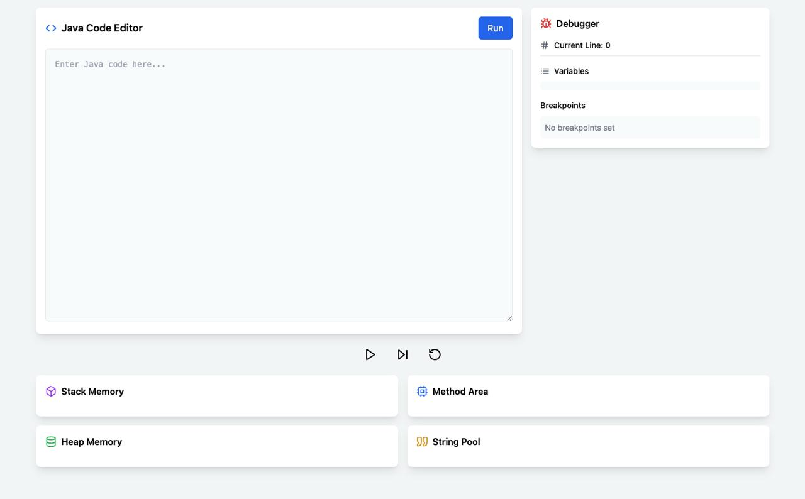

# Java Memory Visualizer

A real-time Java execution and memory visualization platform designed for students to understand core Java concepts through interactive visualization. The system provides a comprehensive view of Java memory management, including stack frames, heap objects, method area, and string pool, all updating in real-time as code executes.



## Table of Contents

- [Features](#features)
- [System Architecture](#system-architecture)
- [Low-Level Design](#low-level-design)
- [Components](#components)
- [Technical Design](#technical-design)
- [Setup & Installation](#setup--installation)
- [Usage](#usage)

## Features

### 1. Interactive Code Editor

- Real-time Java code editing with syntax highlighting
- Immediate execution feedback
- Error handling and compilation status

### 2. Memory Visualization

- Stack frame visualization with local variables
- Heap memory allocation tracking
- Method area for static variables
- String pool monitoring
- Real-time updates during execution

### 3. Debugging Tools

- Step-by-step execution
- Breakpoint management
- Variable inspection
- Execution flow control (play/pause)

### 4. Real-time Updates

- WebSocket-based communication
- Instant memory state updates
- Execution history tracking
- Forward/backward navigation

## System Architecture

### High-Level Architecture

```plaintext
┌──────────────────┐     ┌──────────────────┐     ┌─────────────────┐
│  React Frontend  │◄────┤ WebSocket Server │◄────┤  Java Executor  │
│   (Browser)      │     │    (Node.js)     │     │    (Docker)     │
└──────────────────┘     └──────────────────┘     └─────────────────┘
                               ▲                          ▲
                               │                          │
                               ▼                          ▼
                        ┌──────────────────┐     ┌─────────────────┐
                        │  Kafka Broker    │◄────┤ Zookeeper       │
                        │                  │     │                 │
                        └──────────────────┘     └─────────────────┘
```

## Low-Level Design

### WebSocket Server

```plaintext
┌────────────────────┐
│ WebSocket Server   │
├────────────────────┤
│ Accepts WebSocket  │
│ connections        │
│ Manages sessions   │
│ Sends updates      │
│ Interfaces Kafka   │
└────────────────────┘
```

### Java Executor

```plaintext
┌────────────────────┐
│ Java Executor      │
├────────────────────┤
│ Compiles & Runs    │
│ Tracks Memory      │
│ Publishes Events   │
│ Handles Errors     │
└────────────────────┘
```

### Kafka & Zookeeper

```plaintext
┌───────────────────────┐
│ Kafka Broker          │
├───────────────────────┤
│ Message Queues        │
│ Stores Execution Logs │
└───────────────────────┘

┌───────────────────────┐
│ Zookeeper             │
├───────────────────────┤
│ Manages Kafka State   │
└───────────────────────┘
```

### Frontend Components

```plaintext
┌──────────────────┐
│ CodeEditor       │
├──────────────────┤
│ Code Input UI    │
│ Sends Requests   │
└──────────────────┘

┌──────────────────┐
│ MemoryVisualizer │
├──────────────────┤
│ Displays Stack   │
│ Updates UI       │
└──────────────────┘
```

## Components

### Frontend Components

#### 1. CodeEditor (`src/components/CodeEditor.tsx`)

- Provides Java code editing interface
- Handles code execution requests
- Manages execution state

#### 2. MemoryVisualizer (`src/components/MemoryVisualizer.tsx`)

- Visualizes JVM memory areas:
  - Stack frames
  - Heap objects
  - Method area
  - String pool
- Updates in real-time during execution

#### 3. DebuggerMenu (`src/components/DebuggerMenu.tsx`)

- Manages debugging operations
- Displays current execution state
- Handles breakpoints
- Shows variable values

#### 4. Controls (`src/components/Controls.tsx`)

- Execution control buttons
- Step-by-step navigation
- Play/pause functionality
- Reset capability

### Backend Services

#### 1. WebSocket Server (`websocket-server/server.js`)

- Handles real-time communication
- Manages client connections
- Interfaces with Kafka
- Maintains execution history

#### 2. Java Executor (`java-executor/src/main/java/com/javavisualizer/Executor.java`)

- Compiles and executes Java code
- Tracks memory allocation
- Instruments code for debugging
- Publishes execution steps

## Technical Design

### State Management

```typescript
interface ExecutionState {
  stack: StackFrame[];
  heap: HeapObject[];
  methodArea: MethodArea[];
  stringPool: StringPoolEntry[];
  currentLine: number;
  isRunning: boolean;
  breakpoints: number[];
}
```

### WebSocket Messages

```typescript
interface WebSocketMessage {
  type: "execute" | "step" | "pause" | "resume" | "reset";
  code?: string;
  stepNumber?: number;
  breakpoints?: number[];
}
```

### Memory Tracking

```typescript
interface StackFrame {
  methodName: string;
  variables: Variable[];
  returnAddress: number;
}

interface HeapObject {
  id: string;
  type: string;
  fields: Variable[];
  references: number;
}

interface StringPoolEntry {
  value: string;
  references: number;
}
```

## Setup & Installation

1. Clone the repository
2. Install dependencies:
   ```bash
   npm install
   ```
3. Start the services using Docker Compose:
   ```bash
   docker-compose up
   ```

## Usage

1. Open the application in your browser
2. Write or paste Java code in the editor
3. Click "Run" to execute
4. Use the control panel to:
   - Step through execution
   - Set breakpoints
   - Inspect variables
   - Monitor memory state

## Contributing

1. Fork the repository
2. Create a feature branch
3. Commit your changes
4. Push to the branch
5. Create a Pull Request

## License

MIT License - See LICENSE file for details
